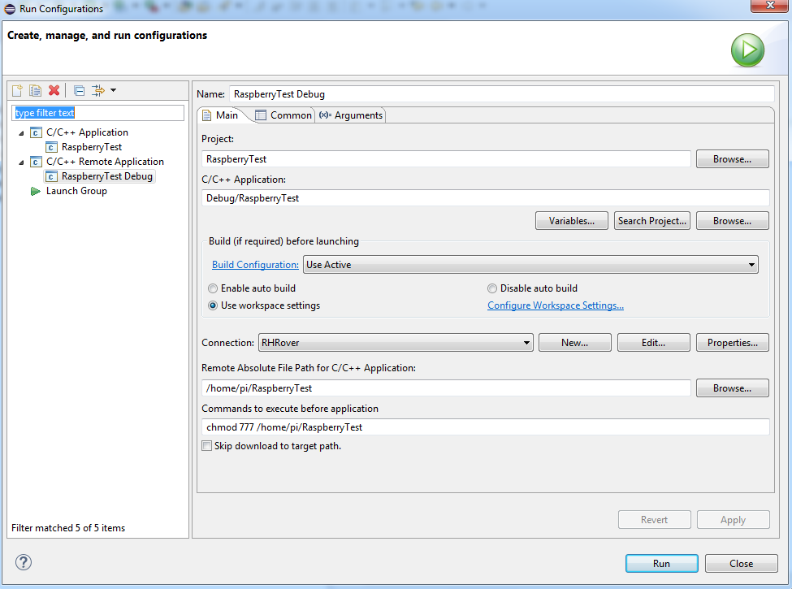
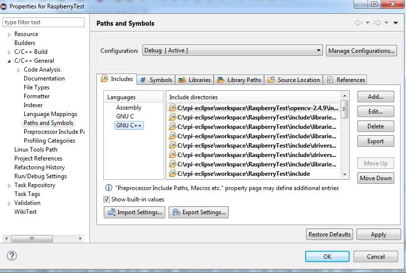

.. toctree::
   :glob:

Cross Development in Raspbian
########################################

Roverapp Software Development Kit (SDK) for Raspbian 
====================================================

Cross Development with Windows using Eclipse CDT
================================================
In this section, cross development using Eclipse CDT IDE in Windows platform is explained.

****************************************
Step 1: Windows Toolchain Setup
****************************************
Raspberry Pi toolchain installations for Windows are provided in `this website <http://gnutoolchains.com/raspberry/>`_. Download raspbian-jessie or raspbian-stretch toolchain to match which distro used in the rover.

*******************************************
Step 2: Downloading and Installing Eclipse
*******************************************
Next step is to download the Eclipse CDT. Follow these steps :`Eclipse IDE Setup <http://www.gurucoding.com/en/raspberry_pi_eclipse/installing_eclipse.php>`_.

********************************************
Step 3: Setting Up Cross Compiler in Eclipse
********************************************
Now that Eclipse is running, the next step is to set up the cross compiler aligned with the Raspberry Pi toolchain : `Cross Compiler Setup <http://www.gurucoding.com/en/raspberry_pi_eclipse/raspberry_pi_cross_compilation_in_eclipse.php>`_.

********************************************
Step 4: More configuration
********************************************
In the Eclipse project, make sure that following properties for your project is present:

.. image:: ../roverstatic/images/forth.png
   :width: 100%
   :align: center
   :alt: ../roverstatic/images/forth.png
   
In run configurations, apply the following changes. Make sure to change ``RaspberryTest`` to ``roverapp``. Under Connection, enter your SSH credentials. 

   
.. warning:: In order to avoid certain authentication problems, connecting as root can be considered.

.. image:: ../roverstatic/images/sixth.png
   :width: 70%
   :align: center
   :alt: ../roverstatic/images/sixth.png

********************************************
Step 5: Adding Libraries
********************************************
The following image demonstrates how to add precompiled libraries to toolchain. Make the necessary changes and simply add names of all libraries below under C/C++ General > Paths and Symbols > Libraries.
   
.. image:: ../roverstatic/images/seventh_addinglibs.png
   :width: 100%
   :align: center
   :alt: ../roverstatic/images/seventh_addinglibs.png
      
Under Library Paths tab, you should point to where precompiled libraries (shared libraries ``.so``, archives ``.a``) are located (for linking) in your installed Raspberry Pi toolchain:

.. image:: ../roverstatic/images/libpaths.png
   :width: 100%
   :align: center
   :alt: ../roverstatic/images/libpaths.png
   
To compile with precompiled libraries (such as the dependencies for roverapp), it is important that every linked library has their respective libraries (include paths) pointed in C/C++ General > Paths and Symbols > Includes :

   
.. warning:: Be sure to add include paths to the respective sections Assembly, GCC, G++ depending on which compiler is used for which packages.

.. warning:: Be sure that every precompiled library that will be compiled and linked must be already installed in rover's Raspbian/Linux environment. Libraries are found in ``/usr/lib`` and ``/usr/local/lib``.
   A shared library can be searched by making use of the following command (for example, ``opencv_core``):
   
   .. code-block:: bash

      sudo find / -name *opencv_core*so*

Next, be sure to add the following under roverapp Project Properties>C/C++ Build>Settings>Tool Settings>Cross G++ Linker>Linker Flags:

   .. code-block:: bash

      -Wl,-rpath-link,"C:\SysGCC\Raspberry\arm-linux-gnueabihf\sysroot\lib\arm-linux-gnueabihf"
	  
Linker paths ``-L`` and libraries to link ``-l`` should be configured as well as follows:

.. image:: ../roverstatic/images/linking.png
   :width: 100%
   :align: center
   :alt: ../roverstatic/images/linking.png
   
In a similar fashion, be sure that ``/include`` paths for libraries to be used are expressed in roverapp Project Properties>C/C++ Build>Settings>Tool Settings>Cross GCC Compiler>Includes and roverapp Project Properties>C/C++ Build>Settings>Tool Settings>Cross G++ Compiler>Includes depending on the compiler used for those packages.

.. image:: ../roverstatic/images/includes2.png
   :width: 100%
   :align: center
   :alt: ../roverstatic/images/includes2.png
   