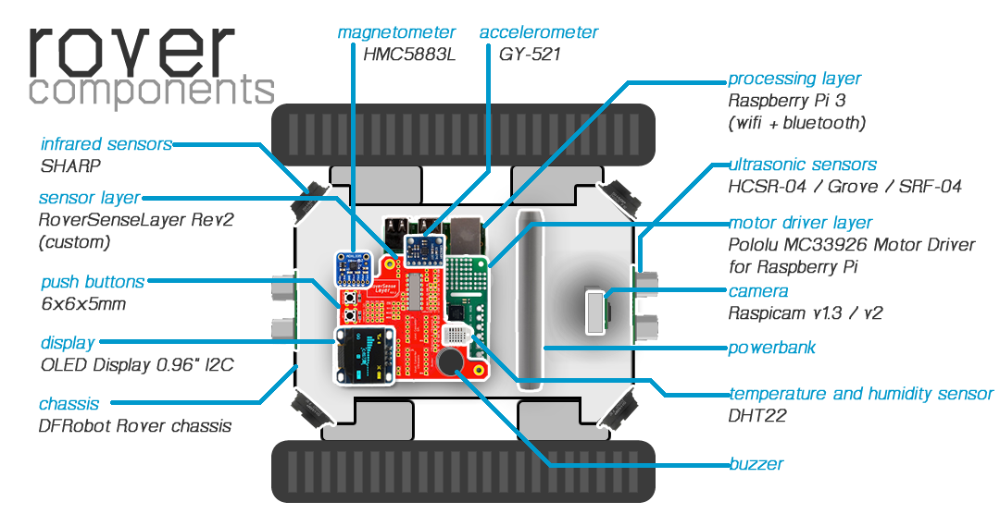

.. toctree::
   :glob:

Rover Hardware
#########################

*************************************************
Complete Rover Hardware Requirements
*************************************************
An illustration of how components look and how they're located in rover is given below:

   
The complete list of materials to construct a rover is given in `APP4MC Rover Wiki <https://wiki.eclipse.org/APP4MC/Rover>`_.

*************************************************
About Motor Driver Layer
*************************************************
In order to drive the motors of the DFRobot rover chassis, `Pololu MC33926 Motor Driver for Raspberry Pi <https://www.pololu.com/product/2755/resources>`_ is used as a shield on top of Raspberry Pi 3.

For convenience in applications, following resources might be helpful (taken from Pololu):

* **Schematic Diagram:** `Schematics <https://www.pololu.com/file/0J894/pololu-dual-mc33926-motor-driver-for-raspberry-pi-schematic.pdf>`_

* **DXF Drill Drawing:** `Drill drawing for designing a layer on top <https://www.pololu.com/file/0J1033/rpe02a01-drill.dxf>`_

* **Shield Pin Locations:** *check image*

.. image:: ../roverstatic/images/motorshield.jpg
   :width: 60%
   :align: center
   :alt: ../roverstatic/images/motorshield.jpg

*************************************************
About RoverSenseLayer Revision 2
*************************************************

.. image:: ../roverstatic/images/roversenselayer.png
   :width: 80%
   :align: center
   :alt: ../roverstatic/images/roversenselayer.png
   
RoverSenseLayer Features
===========================
**RoverSenseLayer Revision 2** is a customly made circuit board that is designed as a shield on top of Pololu MC33926 Motor Driver.
RoverSenseLayer Revision 2 provides interfaces for OLED display, sensors, buttons, analog to digital converter, voltage converters, and more.

Complete list of interfaces are given below:

* 2x Push button
* 1x Buzzer
* 4x Sharp GP2Y0A41SK0F Analog Distance Sensor
* 1x Pololu Dual MC33926 Motor Driver Connector
* 1x A/D Converter MCP3208 DIP16
* 2x I2C-tolerant Logic Level Converters
* 1x HMC5883L Magnetometer
* 1x GY-521Y Accelerometer
* 1x OLED Display 0.96" I2C 4-pin
* 1x DHT22 Temperature and Humidity Sensor
* 2x HCSR-04 or Grove Ultrasonic Sensor
* 4x Extra I2C lines for various sensors

RoverSenseLayer Revision 2 design properties are as follows for production:

* Two-sided 82x67mm
* Minimum hole size 0.3mm
* Minimum track/spacing 6/6mil
* Cutouts required
* Plating required
* (Preferrably) Red solder Mask
* (Preferrably) White silkscreen

RoverSenseLayer Schematics
===========================
Schematics can be found in the following git repository:

`https://github.com/app4mc-rover/rover-sense-layer-rev2 <https://github.com/app4mc-rover/rover-sense-layer-rev2>`_

RoverSenseLayer Source Files 
=============================
KiCad design files can be found in the following git repository:

`https://github.com/app4mc-rover/rover-sense-layer-rev2 <https://github.com/app4mc-rover/rover-sense-layer-rev2>`_